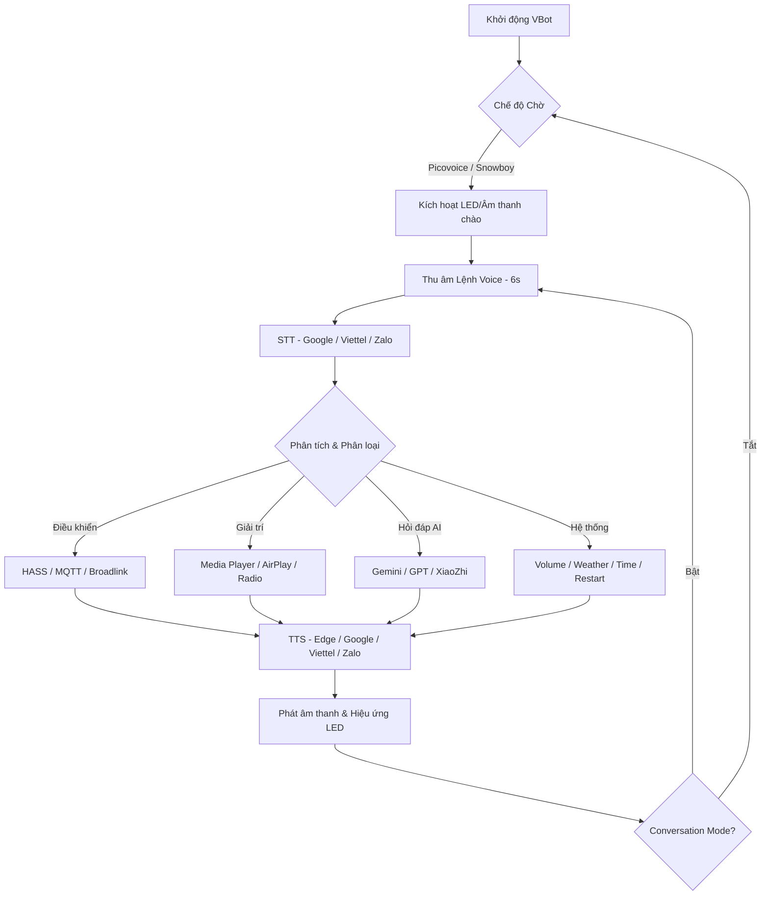

# VBot Assistant - Trợ Lý Loa Thông Minh Tiếng Việt Toàn Diện

VBot Assistant là giải pháp loa thông minh tiếng Việt mã nguồn mở cao cấp, được thiết kế tối ưu cho nền tảng Raspberry Pi (đặc biệt là Zero 2W). Dự án cung cấp khả năng tương tác giọng nói tự nhiên, điều khiển nhà thông minh (Smarthome) và hệ thống giải trí đa phương tiện mạnh mẽ.

---

## 🌟 Tính Năng Nổi Bật

### 1. Điều Khiển Nhà Thông Minh (Smart Home)
*   **Tích hợp Home Assistant (HASS):** Điều khiển thực thể (Lights, Switches, Covers, Scripts...) qua API/Websocket. Phản hồi trạng thái thiết bị bằng giọng nói.
*   **VBot Custom Component:** Cho phép liên kết VBot vào Home Assistant như một Media Player chuyên nghiệp, hỗ trợ thông báo TTS và điều khiển từ xa.
    *   [Link Repository Custom Component](https://github.com/marion001/VBot_Offline_Custom_Component)
*   **Hỗ trợ HASS Assist:** Tích hợp sâu vào tính năng "Assist" của HA để trở thành một tác nhân hội thoại (Conversation Agent) mạnh mẽ.
    *   [Link Repository Assist Integration](https://github.com/marion001/VBot-Assist-Conversation)
*   **Xử lý Đa Lệnh (Multiple Commands):** Thực hiện nhiều hành động trong một câu nói.
    *   *Ví dụ: "Bật đèn phòng khách, mở rèm và phát nhạc thư giãn".*
*   **Hỗ trợ Broadlink & MQTT:** Điều khiển thiết bị IR/RF và giao tiếp với các module tự chế (ESP8266/ESP32) qua MQTT.
*   **Custom Commands:** Định nghĩa các câu lệnh điều khiển HASS tùy biến qua file JSON (`resource/hass/Home_Assistant_Custom.json`).

### 2. Hệ Thống Giải Trí Đa Phương Tiện
*   **Âm Nhạc:** Tích hợp Zing MP3, YouTube Music, Nhaccuatui và Music Local.
*   **Kết nối Không dây:** 
    *   **AirPlay (Shairport-Sync):** Truyền phát nhạc chất lượng cao từ thiết bị Apple (iPhone, iPad, Mac).
    *   **Bluetooth Sink:** Biến VBot thành loa Bluetooth cho mọi thiết bị di động.
*   **Tin Tức:** Cập nhật tin tức từ VnExpress, Dân Trí, Báo Mới... dưới dạng Podcast/Audio.
*   **Radio Online:** Hỗ trợ các kênh VOV1, VOV2, VOV3, VOV5, VOV Giao thông...
*   **Podcast & Kể Chuyện:** Kho nội dung phong phú cho mọi lứa tuổi.

### 3. Trợ Lý Ảo & Công Nghệ Lõi
*   **Đa Trợ Lý AI:** Linh hoạt chuyển đổi giữa các bộ não **XiaoZhi**, **Google Gemini**, **ChatGPT**, **Zalo Assistant**.
*   **Nhận diện Giọng nói (STT):** Tích hợp các engine mạnh mẽ như **Google Cloud Speech-to-Text**, **Viettel AI**, **Zalo STT** và các bộ STT mặc định.
*   **Tổng hợp Giọng nói (TTS):** Hỗ trợ giọng nói tự nhiên từ **Microsoft Edge TTS**, **Google Wavenet**, **Viettel AI**, **Zalo TTS**.
*   **Nhận diện từ khóa (Wake-word):** Tích hợp công nghệ **Picovoice (Porcupine)** và **Snowboy**, hỗ trợ đa từ khóa đánh thức ("Ê Cu", "Hey Google", "Jarvis"...).
*   **Chế độ hội thoại liên tục:** Tự động lắng nghe phản hồi mà không cần gọi lại từ khóa.

### 4. Tiện Ích & Hệ Thống
*   **Lập Lịch & Thông Báo (Scheduler):** Hẹn giờ, nhắc nhở, tự động bật/tắt Micro theo thời gian định sẵn.
*   **Lịch Âm/Dương:** Tra cứu lịch âm, ngày mùng mấy, ngày hoàng đạo... qua giọng nói.
*   **Hệ Sinh Thái Loa Chủ & Vệ Tinh (Satellite Speaker):** VBot có thể đóng vai trò làm Loa Chủ (Main Speaker) để kết nối và quản lý danh sách các thiết bị VBot Client chạy trên **ESP32**, **ESP32-S3**, **Loa Phicomm R1**, v.v. qua giao thức Socket/UDP.
*   **Khám phá thiết bị (mDNS/Zeroconf):** Tự động nhận diện thiết bị trong mạng LAN giúp việc kết nối và quản lý trở nên dễ dàng.
*   **Sao Lưu & Phục Hồi:** Tự động sao lưu dữ liệu quan trọng khi nâng cấp hoặc cập nhật chương trình.
*   **Cloud Backup:** Hỗ trợ tải dữ liệu sao lưu lên Google Drive để đảm bảo an toàn.
*   **Tự Động Cập Nhật:** Nâng cấp chương trình và WebUI chỉ với 1 click.
*   **Phần mềm hỗ trợ Windows:** Cung cấp công cụ trên Windows giúp tìm kiếm nhanh các thiết bị chạy VBot và VBot Client trong cùng mạng LAN.

---

## 🌐 Giao Diện Quản Trị WebUI

VBot cung cấp một WebUI mạnh mẽ giúp người dùng quản lý thiết bị một cách trực quan:

*   **Bảng Điều Khiển (Dashboard):** Theo dõi trạng thái hệ thống thời gian thực (CPU, Nhiệt độ, RAM...).
*   **Quản Lý Cấu Hình:** Chỉnh sửa trực tiếp `Config.json` ngay trên trình duyệt.
*   **Quản Lý Giải Trí:** Tạo và chỉnh sửa danh sách phát (Playlist), Radio và Podcast.
*   **Trình Xem Log (Log Viewer):** Theo dõi quá trình nhận diện giọng nói và phản hồi hệ thống.
*   **Điều Khiển Thiết Bị:** Kiểm soát âm lượng, đèn LED và Microphone.
*   **Quản Lý Lịch Hẹn:** Thiết lập các lời nhắc hoặc lịch phát nhạc tự động.

---

## 🔌 Giao Tiếp API & MQTT (Dành cho Tích Hợp)

VBot cung cấp khả năng kết nối mạnh mẽ với các hệ thống bên thứ ba:

*   **RESTful API:** Hỗ trợ các Endpoint để lấy trạng thái hệ thống, điều khiển Media Player, điều chỉnh âm lượng, phát TTS, và gửi câu lệnh Chatbot.
    *   Hỗ trợ **Server-Sent Events (SSE)** để cập nhật trạng thái thời gian thực.
*   **MQTT Broker:** VBot có thể kết nối với MQTT Broker để nhận lệnh điều khiển hoặc xuất trạng thái thiết bị, giúp tích hợp dễ dàng vào các hệ thống Smarthome như Home Assistant, Node-RED...

---

## 🏗️ Kiến Trúc Hệ Thống & Luồng Dữ Liệu

### Sơ đồ luồng xử lý chi tiết

---

## 👨‍💻 Dành Cho Nhà Phát Triển (Customization)

VBot cực kỳ linh hoạt cho việc mở rộng:

### 1. Danh Sách Các File Tùy Biến (Customization Files)
VBot cung cấp hệ thống file `Dev_*.py` để bạn có thể can thiệp vào mọi công đoạn của hệ thống mà không làm ảnh hưởng đến lõi (Core) của chương trình:

*   **`Dev_Customization.py`:** File quan trọng nhất để viết các kỹ năng riêng (Custom Skills). Bạn có thể bắt từ khóa và thực hiện các hành động như điều khiển thiết bị, phát âm thanh tùy ý.
*   **`Dev_Assistant.py`:** Tùy biến hoặc tích hợp thêm các bộ não AI mới cho trợ lý.
*   **`Dev_Led.py`:** Thiết kế các hiệu ứng nháy đèn LED riêng cho các trạng thái: Chờ, Nghĩ, Nói, Lỗi...
*   **`Dev_Music.py`:** Tích hợp thêm các nguồn nhạc trực tuyến hoặc cách thức lấy link nhạc mới.
*   **`Dev_TTS.py`:** Thêm các engine chuyển đổi Văn bản thành Giọng nói (Text-to-Speech) khác.
*   **`Dev_STT.py`:** Tùy biến bộ nhận diện Giọng nói thành Văn bản (Speech-to-Text).
*   **`Dev_Weather.py`:** Tùy biến nguồn dữ liệu thời tiết (OpenWeather, WeatherAPI...).
*   **`Dev_Processing.py`:** Can thiệp sâu vào quá trình phân tích và xử lý chuỗi văn bản sau khi nhận diện.
*   **`Dev_Logs.py`:** Tùy chỉnh cách thức ghi log hoặc đẩy log lên các hệ thống giám sát khác.
*   **`Dev_Picovoice.py`:** Cấu hình sâu cho bộ nhận diện từ khóa đánh thức Picovoice.

### 2. Tùy Biến NLP (Xử Lý Ngôn Ngữ) thông qua JSON
Thay đổi cách VBot hiểu câu lệnh tại các file json:
*   **`Action.json`:** Từ khóa hành động (bật, tắt, phát...).
*   **`Adverbs.json`:**
*   **`Object.json`:** Đối tượng điều khiển (đèn, rèm, nhạc...).

---

## 💻 Yêu Cầu Phần Cứng & Mạch DIY

*   **Raspberry Pi:** Khuyên dùng **Pi Zero 2W**.
*   **Mạch Mic:** ReSpeaker HAT, VBot AIO, Vietbot AIO, Module I2S INMP441 hoặc các module Mic I2S khác có chức năng tương tự.
*   **Âm thanh:** Loa 3.5mm, USB, DAC I2S MAX89357 hoặc các mạch DAC tương tự.
*   **LED:** WS2812B/APA102 (GPIO10).
*   **Điều khiển:** Nút nhấn (Wakeup, Volume, Mic) hoặc Rotary Encoder.

---

## 🚀 Cài Đặt & Sử Dụng

### 1. Sử dụng Image Build sẵn (Đề nghị)
1.  **Tải IMG:** [Google Drive - VBot Images](https://drive.google.com/drive/folders/1rB3P8rev2byxgRsXS7mAdkKRj7j0M4xZ)
    *   **Loại Image mặc định (Không có chữ `i2s`):** Dành cho các mạch sử dụng IC **WM8960** (như ReSpeaker 2-Mics Pi HAT) hoặc mạch **VBot AIO** tiêu chuẩn.
    *   **Loại Image `i2s` (Có chữ `i2s`):** Dành cho cấu hình sử dụng **Mic INMP441** (hoặc các Mic I2S tương tự) kết hợp với **MAX89357** hoặc các mạch DAC audio khác có chức năng chân tương tự hoặc mạch **VBot AIO i2s**.
    *   **Lưu ý:** Nếu sử dụng các mạch Mic hoặc âm thanh khác, bạn nên sử dụng **Image mặc định** (không có chữ `i2s`) và tự cấu hình, cài đặt driver tương thích để hệ thống có thể nhận diện đúng Card ID của thiết bị.
2.  **Flash:** Sử dụng BalenaEtcher hoặc Raspberry Pi Imager nạp vào thẻ nhớ.
3.  **Khởi động:** Cắm thẻ, cấp nguồn và chờ hệ thống khởi tạo.

### 2. Cấu Hình Kết Nối WiFi
VBot hỗ trợ thiết lập mạng WiFi cực kỳ đơn giản mà không cần kết nối màn hình/bàn phím:
*   **Sử dụng App di động:** Tải ứng dụng **BTBerryWifi** (có sẵn trên cả iOS và Android).
*   **Phương thức:** Ứng dụng hỗ trợ quét và cấu hình WiFi cho loa thông qua kết nối **Bluetooth** hoặc **Hotspot** (Điểm phát sóng tự động của Pi).
*   **Ưu điểm:** Giúp người dùng dễ dàng mang loa đi sử dụng ở các môi trường mạng khác nhau.

### 3. Vận Hành & Quản lý qua SSH
*   **Thông tin SSH:** User: `pi` | **Pass:** `vbot123`
*   **Cơ chế hoạt động:** VBot có hai chế độ vận hành chính:
    1.  **Chạy tự động (Auto):** Hệ thống tự khởi động cùng OS. Điều khiển qua service:
        `systemctl --user [start|stop|restart] VBot_Offline.service`
    2.  **Chạy thủ công (Manual):** Dùng để theo dõi log trực tiếp hoặc gỡ lỗi.
        *   Cần dừng chạy tự động trước: `systemctl --user stop VBot_Offline.service`
        *   Di chuyển vào thư mục: `cd VBot_Offline`
        *   Chạy lệnh: `python3 Start.py`
        *   Nhấn **Ctrl+C** để kết thúc chạy thủ công.
*   **Khôi phục chạy tự động:** Có thể reboot lại hệ thống, rút nguồn cắm lại hoặc chạy lệnh `systemctl --user start VBot_Offline.service`.

---

## 🤝 Liên Hệ & Cộng Đồng

*   **Tác giả:** Vũ Tuyển (VBot Assistant)
*   **Facebook:** [Vũ Tuyển Dev](https://www.facebook.com/TWFyaW9uMDAx)
*   **Cộng đồng:** [Group VBot Assistant](https://www.facebook.com/groups/1148385343358824)

---
*VBot Assistant - Mang trí tuệ nhân tạo thực sự vào ngôi nhà Việt.*

