# Sơ đồ xử lý và luồng hoạt động hoàn chỉnh của VBot

Tài liệu này mô tả kiến trúc đang được triển khai trong mã nguồn VBot. Mục tiêu là giúp người dùng, người viết `Dev_*.py` và người bảo trì biết dữ liệu đi qua đâu, trạng thái nào sở hữu microphone/audio, lúc nào phải kết thúc xử lý và cơ chế cập nhật–rollback hoạt động thế nào.

## 1. Bản đồ tổng thể

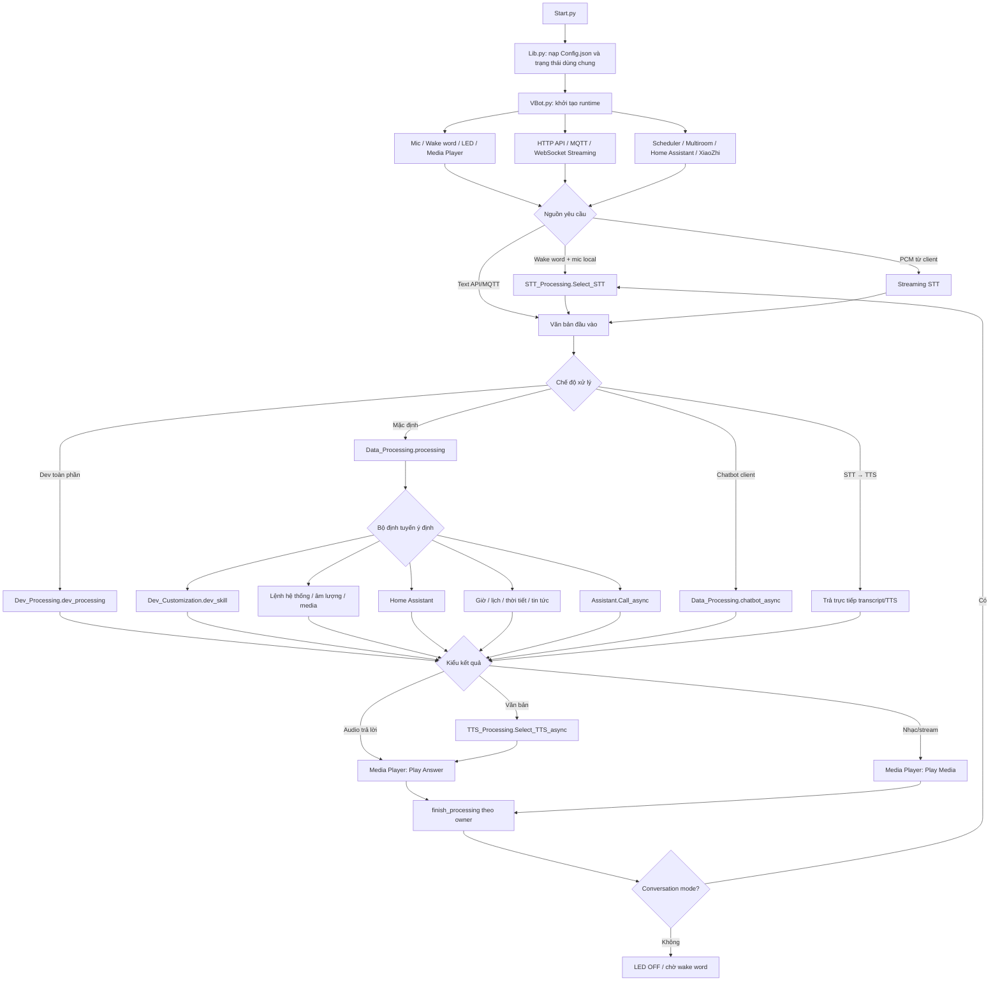

## 2. Khởi động hệ thống

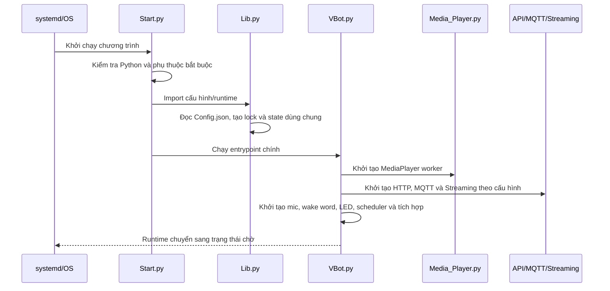

Thành phần chính:

| Thành phần | Trách nhiệm |
|---|---|
| `Start.py` | Điểm vào, kiểm tra môi trường và khởi động VBot. |
| `Lib.py` | Nạp `Config.json`, cung cấp state, lock, logging, microphone ownership và tiện ích dùng chung. |
| `VBot.py` | Điều phối vòng đời, wake word, thu âm và gọi pipeline xử lý. |
| `Media_Player.py` | Phát âm báo, câu trả lời TTS, nhạc/stream và serialize điều khiển media. |
| `Api_HTTP.py` | Nhận lệnh WebUI/API, trả trạng thái và kích hoạt Update Manager. |
| `Api_MQTT.py` | Nhận/phát trạng thái và lệnh MQTT. |
| `Streaming.py` | Quản lý client, PCM, STT và chế độ xử lý của từng phiên. |

Nếu một dependency tùy chọn không có, module tương ứng phải bị vô hiệu hóa có kiểm soát; lỗi không được làm hỏng toàn bộ pipeline nếu chức năng đó không được bật.

## 3. Nguồn đầu vào

### 3.1 Wake word và microphone local

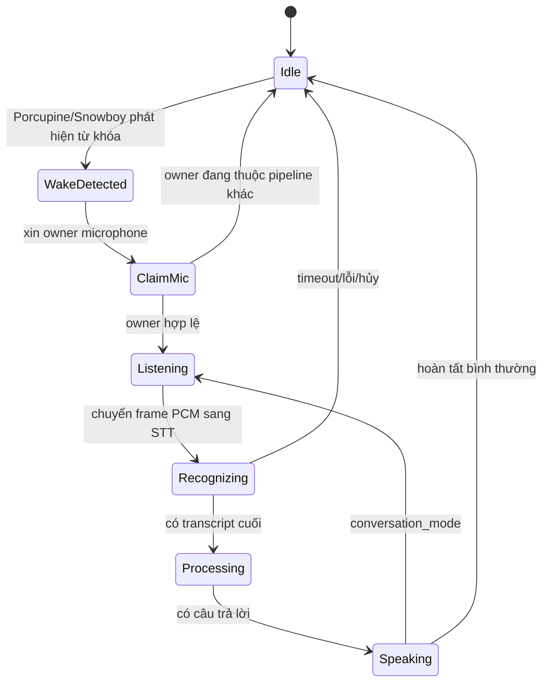

Quy tắc quan trọng:

- Mọi frame mic đi qua cổng đọc chung trong `Lib`, không đọc native recorder đồng thời từ nhiều luồng.
- Một phiên phải chụp/giữ đúng owner. Phiên cũ không được giải phóng owner của phiên mới.
- Khi wake-up bị hủy, task STT và iterator mạng phải được đóng, không để worker tiếp tục đọc mic.
- LED phản ánh trạng thái (`THINK`, `SPEAK`, `ERROR`, `MUTE`, `OFF`) nhưng không phải nguồn sự thật của processing state.

### 3.2 Client Streaming

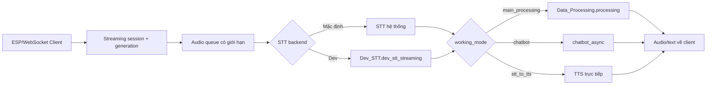

Mỗi lần client reconnect có generation mới. Kết quả từ worker của generation cũ phải bị bỏ để không phát câu trả lời sai phiên.

### 3.3 HTTP API và MQTT

- Yêu cầu text có thể đi thẳng vào xử lý mà không chiếm mic local.
- API điều khiển media/âm lượng phải đi qua facade/queue tương ứng để tránh đua trạng thái.
- API cập nhật chỉ gửi yêu cầu cho `Update_Manager`; tiến trình phục vụ không tự ghi đè code đang chạy.
- MQTT dùng registry/topic đã cấu hình; phản hồi trạng thái phải phản ánh state runtime sau khi thao tác hoàn tất.

## 4. STT – chuyển âm thanh thành văn bản

Điểm điều phối chính là `STT_Processing.Select_STT()`.

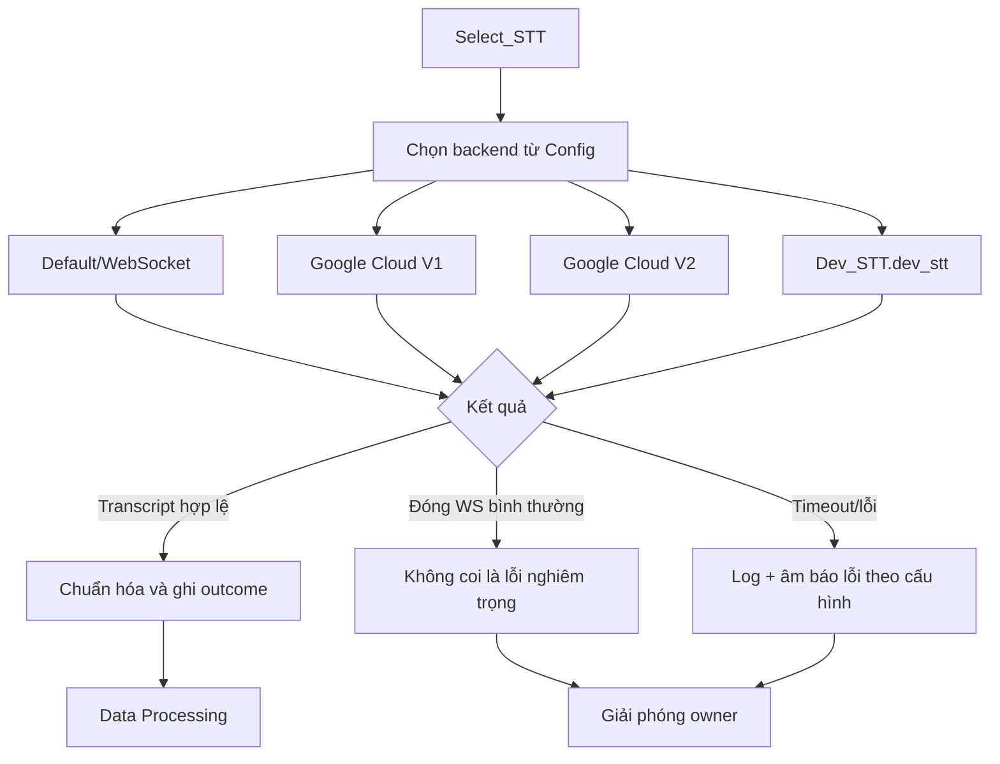

Hợp đồng backend Dev:

- `Dev_STT.dev_stt()` trả `str` hoặc `None`.
- `Dev_STT.dev_stt_streaming(pcm_audio, sample_rate, client_id)` không đọc mic local; chỉ xử lý PCM được truyền vào.
- Transcript cuối của mic local được gán vào `Lib.stt_transcript` để tương thích pipeline.
- Request blocking của SDK phải chạy ngoài event loop.

## 5. Bộ xử lý câu lệnh

`Data_Processing.processing(text_input)` là cổng chính. Hàm bọc quản lý owner và gọi `_processing_impl`.

Thứ tự khái quát:

1. Kiểm tra input, chuẩn hóa chữ thường và từ khóa.
2. Nhận processing ownership.
3. Xử lý multi-command nếu câu chứa nhiều lệnh.
4. Thử các lệnh ưu tiên: trạng thái, mic, âm lượng, hệ thống và điều khiển media.
5. Thử tích hợp Home Assistant và các action đã cấu hình.
6. Thử thời tiết, lịch, nhắc việc, radio, podcast, báo và nguồn nhạc.
7. Nếu bật Custom Skill, gọi `Dev_Customization.dev_skill`.
8. Nếu chưa có handler nhận yêu cầu, chuyển sang trợ lý ảo.
9. Phát kết quả và giải phóng đúng owner.

### Ý nghĩa kết quả của Custom Skill

| Kết quả | Ý nghĩa |
|---|---|
| `True` | Skill đã xử lý xong; VBot không chạy các handler phía sau. |
| `False` hoặc `None` | Skill bỏ qua; pipeline mặc định tiếp tục. |
| Exception | Được ghi log; pipeline cố gắng tiếp tục theo nhánh dự phòng. |

`Dev_Customization.py` không được tự ý giải phóng owner không thuộc về nó. Với media metadata, dùng `Lib.vbot_state.set_media_metadata(...)` thay vì cập nhật từng biến rời rạc.

## 6. Chế độ Dev Processing toàn phần

Khi WebUI chọn chế độ người dùng tự xử lý, `Data_Processing` chuyển sang `Dev_Processing.dev_processing`.

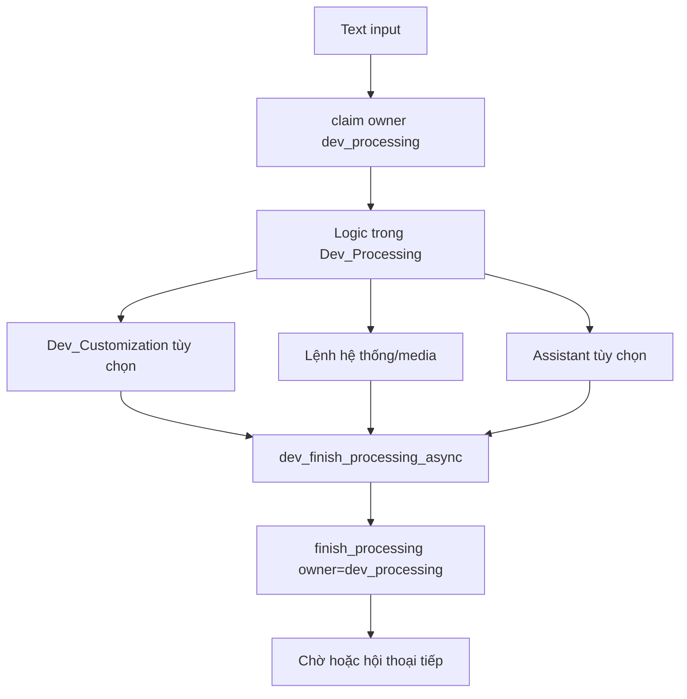

`_DEV_PROCESSING_OWNER` là định danh nội bộ. Không đổi nếu chưa sửa đồng bộ cơ chế ownership. Mọi đường return đã xử lý phải hoàn tất state; tránh gán trực tiếp một cờ Boolean cũ rồi bỏ lock/owner lại phía sau.

## 7. Assistant và TTS

### Assistant

`Assistant.Call_async` chọn backend theo độ ưu tiên và cấu hình. Backend Dev được gọi qua `Dev_Assistant.dev_assistant(text_input, used_for)`.

Hợp đồng trả về là `(audio, text)`:

- Có `audio`: có thể phát trực tiếp.
- Có `text` nhưng chưa có audio: chuyển qua TTS.
- Cả hai `None`: backend thất bại/bỏ qua, pipeline dùng fallback nếu có.

### TTS

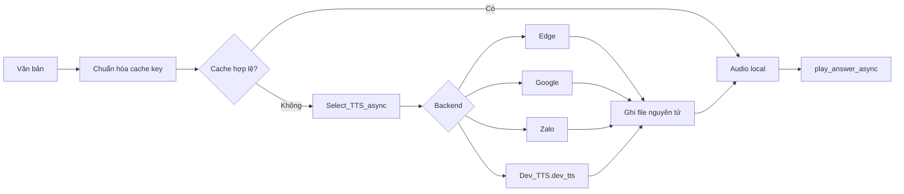

Cache chỉ coi file hoàn chỉnh là kết quả; file tạm/đang ghi không được phát. Backend thất bại phải trả `None`, không trả đường dẫn giả. API key/credentials không được ghi vào log hoặc commit công khai.

## 8. Media Player và quyền sở hữu audio

VBot phân biệt ba nhóm phát:

| Nhóm | API tiêu biểu | Dùng cho |
|---|---|---|
| Sound | `play_sound_async` | Ding/dong, thông báo hệ thống, trạng thái cập nhật. |
| Answer | `play_answer_async` | Câu trả lời TTS, thường phát một lần. |
| Media | `play_media_async` | Nhạc, radio, podcast, playlist, stream dài. |

Điều khiển play/pause/continue/stop được serialize để hai nguồn không cùng thay đổi VLC. State media (URL, title, cover, source, vị trí, pause/mute) phải cập nhật qua state/facade dùng chung để WebUI, MQTT, Multiroom và XiaoZhi nhìn thấy cùng một trạng thái.

Khi một nguồn mới chiếm audio:

1. Xác định nguồn hiện tại.
2. Dừng/tạm dừng nguồn cũ theo chính sách takeover.
3. Cập nhật metadata và generation.
4. Bắt đầu nguồn mới.
5. Chỉ callback đúng generation mới được thay đổi trạng thái cuối.

## 9. LED

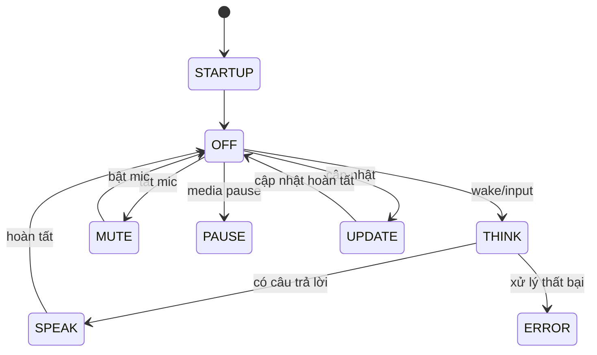

`Dev_Led.py` phải giữ các hàm `LED_OFF`, `LED_LOADING`, `LED_THINK`, `LED_MUTE`, `LED_ERROR`, `LED_PAUSE`, `LED_SPEAK`, `LED_STARTUP`, `LED_UPDATE`, `LED_VOLUME`. Hiệu ứng lặp phải thường xuyên kiểm tra `Lib.current_led_effect` và `Lib.led_effect_active`.

## 10. Hoàn tất processing và conversation mode

Đây là phần dễ gây treo nhất.

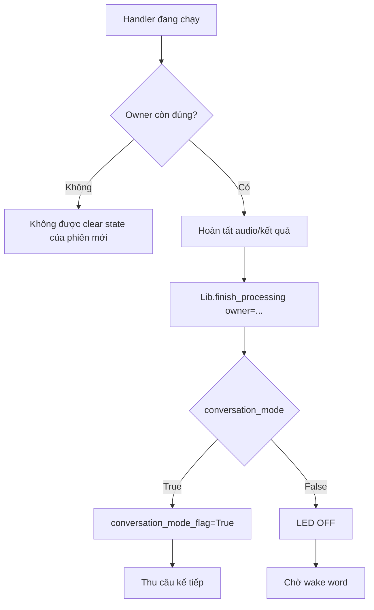

Không dùng cleanup cưỡng bức trừ shutdown/recovery được thiết kế rõ. Một task timeout hoặc bị cancel vẫn phải chạy `finally` để nhả tài nguyên của chính nó.

## 11. Home Assistant, XiaoZhi, Multiroom và Scheduler

- **Home Assistant:** handler phân tích entity/action, gọi API, phát phản hồi hoặc fallback; lỗi mạng không được giữ processing owner.
- **XiaoZhi:** có pipeline và media takeover riêng; yêu cầu MCP được kiểm tra schema trước khi thực thi.
- **Multiroom:** metadata và trạng thái pause/mute được đồng bộ; receiver phải dừng nhanh khi nguồn cục bộ chiếm audio.
- **Scheduler:** lịch/nhắc việc chạy nền; khi phát âm thanh vẫn phải tuân thủ audio ownership và trạng thái runtime.

## 12. Cập nhật chương trình và WebUI

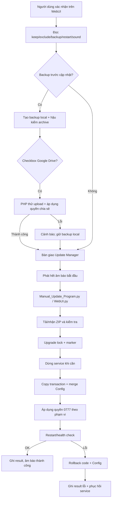

Các nguyên tắc:

- Chạy trực tiếp `Manual_Update_Program.py`/`Manual_Update_WebUI.py` không tải Cloud.
- Upload Google Drive do yêu cầu WebUI kích hoạt; lỗi Cloud là cảnh báo và không hủy cập nhật nếu backup local đã thành công.
- Danh sách giữ lại và loại trừ được truyền rõ; Python không tự suy đoán khi WebUI đã cung cấp danh sách.
- `Config.json` được merge có kiểm soát; dữ liệu người dùng không bị thay bằng template mới.
- Rollback giao dịch luôn được tạo trước khi thay file.
- PHP giữ cơ chế đặt `0777`; updater Python cũng áp dụng quyền theo phạm vi đã quy định.

## 13. Backup Google Drive

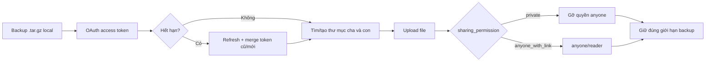

Không ghi trực tiếp refresh response thay token cũ vì Google có thể không trả lại `refresh_token`. Luôn merge rồi ghi nguyên tử. Chế độ mặc định là `private`.

## 14. Luồng lỗi và phục hồi

| Điểm lỗi | Phản ứng mong đợi |
|---|---|
| Mic owner không hợp lệ | Dừng phiên hiện tại, không đọc mic. |
| STT timeout/lỗi | Cancel worker/stream, ghi outcome, nhả owner, phát báo lỗi nếu bật. |
| Handler exception | Ghi log có context, chạy fallback hoặc kết thúc an toàn. |
| TTS lỗi | Không phát file dở; backend/fallback khác có thể tiếp tục. |
| Media callback cũ | Bỏ qua nếu generation không còn hợp lệ. |
| Client disconnect | Hủy task phiên, bỏ queue và nhả owner đúng client. |
| Google Drive lỗi | Giữ backup local, cảnh báo; cập nhật WebUI vẫn tiếp tục. |
| Gói cập nhật không hợp lệ | Không thay file hiện tại. |
| Copy/restart/health check lỗi | Rollback code và `Config.json`, phục hồi service. |
| Shutdown | Ngừng nhận việc mới, cancel task, dừng worker/media và giải phóng tài nguyên. |

## 15. Hợp đồng của các file Dev

| File | Điểm vào bắt buộc | Kết quả |
|---|---|---|
| `Dev_Assistant.py` | `async dev_assistant(text_input, used_for=None)` | `(audio, text)` |
| `Dev_Customization.py` | `async dev_skill(input_text)` | `True` nếu đã xử lý, `False/None` nếu bỏ qua |
| `Dev_Led.py` | Các hàm `LED_*` | Không yêu cầu giá trị trả về |
| `Dev_Logs.py` | `logs_dev(logs_text)` | Không gọi ngược logger gây đệ quy |
| `Dev_Music.py` | `async custom_music_async(input_text)` | `(url, title, cover, source)` |
| `Dev_Picovoice.py` | `keyword_paths`, `sensitivities`, `model_file_path` | Biến cấu hình module |
| `Dev_Processing.py` | `async dev_processing(text_input)` | Trạng thái đã xử lý |
| `Dev_STT.py` | `dev_stt`, `dev_stt_streaming` | Transcript hoặc `None` |
| `Dev_TTS.py` | `async dev_tts(text_input)` | Đường dẫn audio/URL hoặc `None` |
| `Dev_Weather.py` | `async custom_weather(text_input, text_input_handle)` | `(audio, text)` |

## 16. Checklist khi thêm một tính năng

1. Xác định nguồn gọi và coroutine/thread đang chạy.
2. Xác định có cần processing, mic hoặc audio ownership không.
3. Đặt timeout cho mạng và subprocess.
4. Không block event loop bằng SDK/hàm I/O đồng bộ.
5. Chuẩn hóa input và kiểm tra schema response.
6. Không log API key, token, mật khẩu hoặc nội dung credentials.
7. Dùng API state/media dùng chung thay vì gán nhiều biến rời rạc.
8. Bảo đảm mọi nhánh return/error/cancel đều cleanup đúng owner.
9. Không phát file tạm hoặc dữ liệu chưa hoàn chỉnh.
10. Thêm kiểm thử success, timeout, cancel, reconnect và exception.

## 17. Cách đọc log để lần theo một yêu cầu

Theo dõi theo thứ tự:

```text
Nguồn input/client
→ owner/generation
→ backend STT + outcome
→ Data_Processing/Dev_Processing handler
→ Assistant/TTS/Media
→ finish_processing(owner)
→ trạng thái LED/conversation mode
```

Với cập nhật:

```text
WebUI request
→ backup local
→ Google Drive (nếu chọn)
→ Update Manager state
→ updater result file
→ âm báo
→ restart/health/rollback
```

Khi điều tra lỗi, luôn ghép timestamp, owner, client ID, generation và backend; không chỉ nhìn dòng exception cuối cùng.

## 18. Dòng thời gian chi tiết của một câu lệnh local

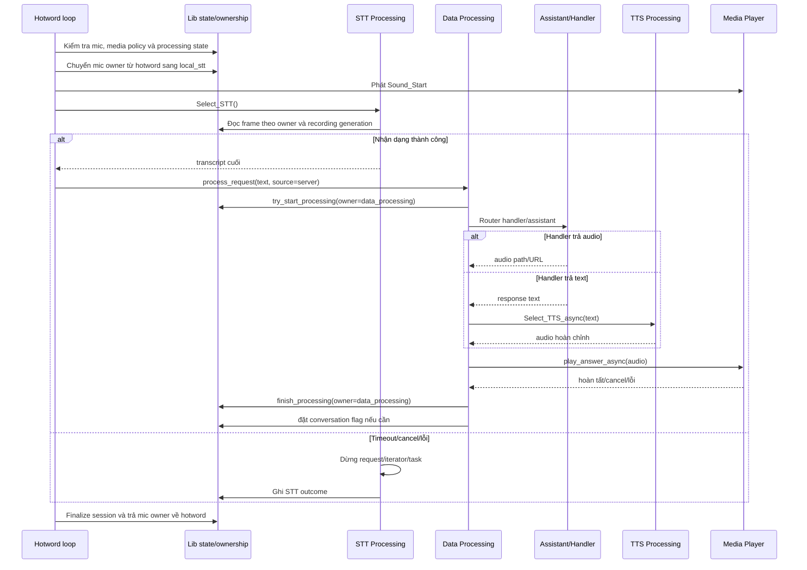

Điểm kiểm tra khi pipeline bị treo:

- `mic_capture_owner` có trả về `hotword` hay không.
- `processing_owner` có còn thuộc một task đã kết thúc hay không.
- `recording_generation` có bị phiên cũ sử dụng không.
- Cờ phát Answer/Media và VLC callback có kết thúc đúng generation không.
- `conversation_mode_flag` có đang chủ động tạo lượt nghe kế tiếp không.

## 19. Luồng shutdown có kiểm soát

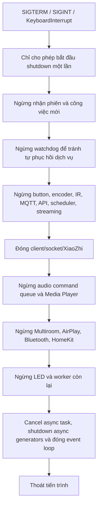

Thứ tự shutdown có chủ đích: watchdog phải dừng trước các dịch vụ mà nó có thể phục hồi; nguồn input dừng trước audio; Media Player chỉ được force-clear mọi owner trong shutdown toàn ứng dụng.

## 20. Các bất biến kiến trúc cần giữ

| Bất biến | Lý do |
|---|---|
| Chỉ một owner xử lý chính tại một thời điểm | Tránh hai câu trả lời và hai thay đổi state cạnh tranh. |
| Chỉ pipeline sở hữu mic được đọc recorder | Tránh native read đồng thời và PCM bị chia sai phiên. |
| Generation cũ không được commit kết quả | Reconnect/cancel không làm sống lại phiên cũ. |
| Callback media phải được serialize | Play/pause/stop không đua nhau trên VLC. |
| File cache chỉ được công bố sau ghi nguyên tử | Không phát MP3/JSON chưa hoàn chỉnh. |
| Refresh token cũ phải được giữ khi refresh | Google thường chỉ trả access token mới. |
| Backup local độc lập với Cloud | Mất mạng không được làm mất khả năng cập nhật/rollback. |
| Updater không ghi code trong process đang phục vụ | Tránh import/module và Config ở trạng thái nửa cũ nửa mới. |
| Mọi I/O ngoài đều có timeout/cancel | Không giữ owner vô thời hạn. |
| Mọi nhánh kết thúc đều cleanup đúng phạm vi | Không để mic, LED, queue hoặc service bị mắc trạng thái. |
